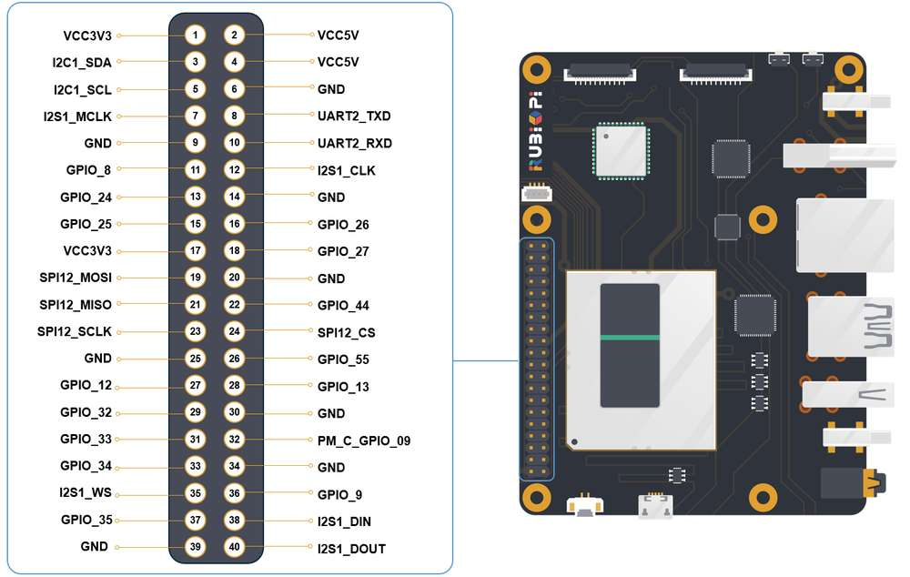

# Rubik Pi Developer Guide

This is my own personal guide to using the Rubik Pi device for various software projects. It is intended to be used alongside my development workflows when targeting the Rubik Pi hardware. I hope you find it useful!

This guide assumes you have basic knowledge of terminal commands and Python.

**Table of Contents**
- [A Note on My Development Environments](#a-note-on-my-development-environments)
- [Source Code](#source-code)
- [Workflows and Versions](#workflows-and-versions)
- [Pinout Diagram](#pinout-diagram)
- [Documentation Links](#documentation-links)

## A Note on My Development Environments
I am using either a Macbook Pro or Dell as a host machine to interface with the Rubik Pi device. See the below table for details.

|               | CPU                | RAM      | OS                  |
|---------------|--------------------|----------|----------------------|
| **Macbook Pro**   | M4 Max             | 64GB     | macOS Sequoia  |
| **Dell 7455**     | Snapdragon X Elite | 32GB     | Windows 11           |

## Source Code
The source code for the Rubik Pi device is located in the [`src`](src) directory. It contains Python scripts for various applications, including OLED display demos, sensor monitoring, and AI chatbot functionality. See the [README](src/README.md) in the `src` directory for more details on each script.

## Workflows and Versions
A subset of workflows for common tasks on the Rubik Pi running [Qualcomm Linux](docs/qualcomm-linux.md) or [Ubuntu](docs/ubuntu-2404.md) can be found in the [docs](docs) directory. A comprehensive list of commands are available in the [Rubik Pi Documentation](https://www.thundercomm.com/rubik-pi-3/en/docs/rubik-pi-3-user-manual/). 

I am currently running [Ubuntu 24.04](docs/ubuntu-2404.md), but it needs to be flashed according to the [setup instructions](docs/ubuntu-2404.md#flashing-the-rubik-pi-device-with-ubuntu-2404). The [Qualcomm Linux Workflows](docs/qualcomm-linux.md) will work out-of-the-box with the Rubik Pi V02.

## Pinout Diagram

## Documentation Links
- [Rubik Pi Documentation](https://www.thundercomm.com/rubik-pi-3/en/docs/rubik-pi-3-user-manual/)
- [Llama API Documentation](https://llama.developer.meta.com/docs/overview/)
- [GitHub Repo](https://github.com/thatrandomfrenchdude/rubik)
- [Hardware Diagram](https://www.thundercomm.com/rubik-pi-3/en/docs/rubik-pi-3-user-manual/1.0.0-a/peripherals-and-interfaces/)